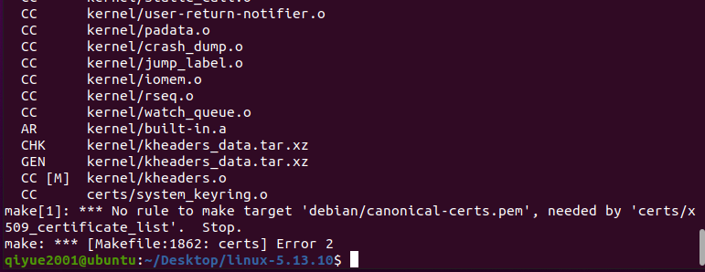

# 操作系统专题实践 - 实验1

**09019216 黄启越 2021-08-26**

[TOC]

## Linux进程管理及其扩展

### 实验目的、实验内容、具体要求

目的：通过实验，加深理解进程控制块、进程队列等概念，了解进程管理的具体实施方法。

内容：实现一个系统调用hide，使得可以根据指定的参数隐藏进程，使用户无法使用ps或top观察到进程状态。

具体要求：

1. 实现系统调用`int hide(pid_t pid, int on)`，在进程pid有效的前提下，如果`on`置1，进程被隐藏，用户无法通过ps或top观察到进程状态；如果`on`置0且此前为隐藏状态，则恢复正常状态。

2. 考虑权限问题，只有root用户才能隐藏进程。

3. 设计一个新的系统调用`int hide_user_processes(uid_t uid, char *binname)`，参数`uid`为用户ID号，当`binname`参数为`NULL`时，隐藏该用户的所有进程；否则，隐藏二进制映像名为`binname`的用户进程。该系统调用应与`hide`系统调用共存。

4. 在`/proc`目录下创建一个文件`/proc/hidden`，该文件可读可写，对应一个全局变量`hidden_flag`，当`hidden_flag`为0时，所有进程都无法隐藏，即便此前进程被`hide`系统调用要求隐藏。只有当`hidden_flag`为1时，此前通过`hide`调用要求被屏蔽的进程才隐藏起来。

5. 在`/proc`目录下创建一个文件`/proc/hidden_process`，该文件的内容包含所有被隐藏进程的pid，各pid之间用空格分开。

### 设计思路
此次实验要求在Linux源码上进行修改，因此需要先了解从Linux内核源码进行编译的过程。

实验要求新增两个系统调用`hide`以及`hide_user_processes`。由于需要记录每个进程是否被隐藏，需要为管理进程信息的结构体`task_struct`增加一个标记位`cloak`。这两个系统调用都只有root用户才有权限调用，因此应当检查uid是否为0（即root用户），从而实现权限控制。如果权限允许，则修改对应的`cloak`标记位。`ps`等工具在列举当前进程时访问的是`\proc`目录，需要修改伪文件系统`procfs`枚举当前进程的函数的实现，从而达到过滤被隐藏进程的目的。

要求4、5则在此基础上，在`procfs`中新增了文件，还要修改读、写回调函数来定义对`/proc/hidden`进行读写和对`/proc/hidden_process`读取时的行为。相应地，`hide`以及`hide_user_processes`系统调用的实现也要新增对`hidden_flag`状态的判断。

### 主要数据结构及其说明

增加系统调用的实验使用了结构体`task_struct`，并新增了成员`cloak`用于记录进程当前隐藏的状态。

### 编译 Linux 内核

1. 在VMWare里安装Ubuntu，保证足够的磁盘空间（这里分配的空闲空间约30GB）。
2. Download the latest source code from https://www.kernel.org/ . 我下载的是`linux-5.13.10.tar.xz`。建议这里下载的内核版本应新于第一步安装的Ubuntu的内核版本。

2. ```shell
   sudo apt-get install vim git fakeroot build-essential ncurses-dev xz-utils libssl-dev bc flex libelf-dev bison
   ```

3. 解压源代码

   ```shell
   cd Desktop
   xz -d <filename>
   tar -xavf <filename>
   ```

   得到`linux-5.13.10`目录。

4. 编辑配置文件。`make mrproper`可以清理之前编译残留的文件，使编译目录干净。

   ```shell
   cd linux-5.13.10
   make mrproper
   ```

   编辑`Makefile`，可以定义自己的内核版本号。`vim Makefile`，修改“EXTRAVERSION =<YOUR_EXTRAVERSION>”，这里我设定的是`EXTRAVERSION =-QYMODMIN`。

   再进行配置。由于不知道哪些模块是系统所必需的，可以拷贝正在运行的内核配置文件作为模板。`make oldconfig`或`make menuconfig`等都可以用于编辑配置文件，这里选择带有图形界面的`menuconfig`。有经验的用户可以在这一步进行裁剪，可以大大缩短编译时间。可以裁剪掉部分网络模块、虚拟化模块、文件系统等。

   ```shell
   sudo cp /boot/config-5.11.0-25-generic .config
   make menuconfig
   ```
   
   

   5. 内核编译阶段。具体所用时间取决于CPU性能和配置。可以加上`-j#`参数进行多线程编译，`#`为线程数，可从`nproc`知晓。

      我的用时，没有开启多线程编译（仅供参考）：
      
      `make`: 21:03-24:08
      
      `make modules_install`：约一分钟
      
      `make install`：不到一分钟
      
      编译后的目录约11GB。
      
      只要不`make clean`（`make mrproper`），再次运行`make`将会进行增量编译，所用时间会大大缩短。
      
      
      
      ```shell
      sudo make -j8
      sudo make modules_install
      sudo make install
      ```
   
6. 选择新内核启动

   需要编辑grub2选项，开启grub菜单。`sudo vim /etc/default/grub`，改为`GRUB_TIMEOUT_STYLE=menu`和`GRUB_TIMEOUT=5`。

   

   

   执行

   ```shell
   sudo update-grub
   sudo reboot
   ```

   在第一步后可以`grep -i timeout /boot/grub/grub.cfg`验证是否更新了`grub.cfg`。

   在grub菜单中选择Advanced options for Ubuntu，在二级菜单中选择新编译的内核，启动。done！

   

   

   

   


### 新增`hide`系统调用

记得先备份源码！

#### 修改`task_struct`

在`/include/linux/sched.h`中，为`task_stuct`新增成员变量。规定：0表示显示，1表示隐藏。


`kernel/fork.c`的`copy_process(pid *, int, int, kernal_clone_args *)`中，为fork的子进程设置clock为0。


#### 修改procfs

在`fs\proc\base.c`的`int proc_pid_readdir(struct file *file, struct dir_context *ctx)`以及`struct dentry *proc_pid_lookup(struct dentry *dentry, unsigned int flags)`中，增加针对`cloak`的判断语句。


#### 添加系统调用

1. 实现`hide`系统调用内容。

   在`kernel`目录下新增`hide.c`，输入以下内容。

   `pid_task(find_vpid(pid), PIDTYPE_PID)`（较早版本内核为`find_task_by_pid(pid)`）可以通过pid获取进程`task_struct`。函数`proc_flush_pid(pid *)`（较早版本内核为`proc_flush_task(struct task_struct *)`）用于清空VFS层的缓冲，解除已有的dentry项。

   `current_uid().val`（较早版本的内核为`current->uid`）用于获取uid。只有root用户，即uid=0才可隐藏进程。

   宏`SYSCALL_DEFINE2`的`2`表示参数个数，参数以`(type, name)`格式呈现。
   
   ```c
   /**
    * MODIFIED
    * Implementation of system call `hide`.
    */
   
   #include <linux/syscalls.h>
   #include <linux/kernel.h>
   #include <linux/linkage.h>
   #include <linux/types.h>
   #include <linux/sched.h>
   #include <linux/pid.h>
   #include <linux/proc_fs.h>
   #include <linux/cred.h>
   
   SYSCALL_DEFINE2(hide, pid_t, pid, int, on)
   {
   	printk("Syscall hide called.");
   	struct task_struct *p;
   	struct pid *thread_pid;
   	p = NULL;
   	if (pid > 0 && current_uid().val == 0) /* only root can hide process */
   	{
   		//OBSOLETE: p=find_task_by_pid(pid);
   		p = pid_task(find_vpid(pid), PIDTYPE_PID);
   		if (!p)
   			return 1;
   		p->cloak = on; /* set the state of the process */
   		if (on == 1) {
   			printk("Process %d is hidden by root.\n", pid);
   		}
   		if (on == 0) {
   			printk("Process %d is displayed by root.\n", pid);
   		}
   		thread_pid = get_pid(p->thread_pid);
   		proc_flush_pid(thread_pid);
   	} else
   		printk("Permission denied. You must be root to hide a process.\n");
   
   	return 0;
   }
   ```
   
   
   
   
   
2. `kernel/Makefile`中增加`hide.o`

   

3. 在`include/linux/syscalls.h`中添加函数原型`asmlinkage int sys_hide(pid_t pid, int on)`。

      

4. 在`arch/x86/entry/syscalls/syscall_64.tbl`的系统调用表中添加`447 common  hide            sys_hide`。注意找准位置，如图所示，增加的系统调用应当在x32系统调用之前。

      注意：这里仅仅为x86_64架构增加了系统调用表项。如果要为i386架构增加，请在`arch/x86/entry/syscalls/syscall_32.tbl`添加表项。如果要为其他架构添加表项，请前往`include/uapi/asm-generic/unistd.h`。
      
      

​     

#### 编写测试程序及测试

重新编译安装。增量编译速度会明显快于第一次编译。推荐使用`-s`选项（`sudo make -s -j8` ），不会打印正常日志，能更容易地发现编译错误。可以重启后观察`uname -a`是否显示为最近一次编译的结果，确定新内核是否已经成功安装。

编辑`hide_test.c`，输入如下内容（要将宏定义的`SYSCALL_NUM`修改为之前自己定义的系统调用号）：

```c
/**

This program tests `hide` system call.

**/

#include <stdio.h>
#include <sys/syscall.h>
#include <unistd.h>

#define SYSCALL_NUM 447

int
main()
{
    pid_t pid = 1;
    int on = 1;
    syscall(SYSCALL_NUM, pid, on);
    return 0;
}
```

使用gcc编译。首先用非root用户测试。

```shell
gcc hide_test.c -o hide_test
sudo chmod +x hide_test
./hide_test
dmesg
```

可以看到，`printk`打印了相关内核消息。


使用`ps -aux`依然可以看到PID为1的进程。


现在，切换到root用户，重复上述实验。

```shell
sudo ./hide_test
dmesg
ps -aux|more
```


可见打印了操作成功的内核消息，PID为1的进程确实被隐藏了。

再测试将隐藏的进程恢复显示。将测试程序中的`int on = 1;`改为`int on = 0;`，重新编译，重复测试步骤。


可见被隐藏的PID=1的进程又重新显示了出来。根据START可知，并没有启动一个新的进程，而仅仅改变了原有进程的可见性。实验成功。

### 新增`hide_user_processes`系统调用

新增系统调用同样需要修改`include/linux/syscalls.h`、`arch/x86/entry/syscalls/syscall_64.tbl`、`kernel/Makefile`。


这一实验与新增`hide`系统调用的实验比较相近，故只列出系统调用实现的代码（`kernel/hide_user_processes.c`）。

```c
/**
 * MODIFIED
 * Implementation of system call `hide_user_processes`
*/

#include <linux/syscalls.h>
#include <linux/kernel.h>
#include <linux/linkage.h>
#include <linux/types.h>
#include <linux/sched.h>
#include <linux/pid.h>
#include <linux/proc_fs.h>
#include <linux/cred.h>
#include <linux/string.h>

SYSCALL_DEFINE3(hide_user_processes, uid_t, uid, char *, binname, int, recover)
{
    struct task_struct *p = NULL;

	if (current_uid().val != 0) { /* only root can call */
		printk("Permission denied. Only root can call hide_user_processes.\n");
		return 1;
	}

	if (recover == 0) /* recover = 0: allow root to hide processes */
	{
		if (binname == NULL)
		/* if null, hide all processes of the given uid */
		{
			for_each_process (p) {
				if (p->cred->uid.val == uid) {
					p->cloak = 1;
					proc_flush_pid(get_pid(p->thread_pid));
				}
			}
			printk("All processes of uid %d are hidden.\n", uid);
		} else /* otherwise, hide the process with the given name */
		{
			char kbinname[TASK_COMM_LEN];
			long len = strncpy_from_user(kbinname, binname, TASK_COMM_LEN);
            kbinname[TASK_COMM_LEN - 1] = '\0';
			if(unlikely(len < 0)){	/* unable to copy from user space */
				printk("Unable to do strncpy_from_user");
				return 2;
			}
			for_each_process (p) {
				char s[TASK_COMM_LEN];
                get_task_comm(s, p);  /* get name("comm") of process */
				if (p->cred->uid.val == uid && strncmp(s, kbinname, TASK_COMM_LEN) == 0) {
					p->cloak = 1;
					printk("Process %s of uid %d is hidden.\n",
					       kbinname, uid);
					proc_flush_pid(get_pid(p->thread_pid));
				}
			}
		}
	}

	/* recover != 0: display all of the processes, including previously hidden ones */
	else {
		for_each_process (p) {
			p->cloak = 0;
		}
	}

	return 0;
}
```

以及测试程序代码`hide_user_processes.c`：

```c
/**

This program tests `hide_user_processes` system call.

**/

#include<stdio.h>
#include<sys/syscall.h>
#include<unistd.h>

#define SYSCALL_NUM 448
#define MY_UID 0

int main()
{
    int syscallNum = SYSCALL_NUM;
    uid_t uid = MY_UID;
    char *binname = "init";
    int recover = 0;
    syscall(syscallNum,uid,binname,recover);
    return 0;
}
```


编译测试程序：

```shell
vim hide_user_processes.c
gcc hide_user_processes.c -o hide_user_processes
sudo chmod +x hide_user_processes
```

测试结果如下：

（1）使用非root用户执行，内核消息输出没有权限的提示。


（2）使用root用户执行，隐藏uid为0的所有进程。对比前后`ps -aux`可见，root用户的所有进程都被隐藏了。


（3）使用root用户执行，隐藏uid为1000（即用户`qiyue2001`，可用`id`命令获得当前用户的uid）的`bash`进程。对比前后`ps -aux`可见，对应的进程被隐藏了。


（4）使用root用户执行，设置recover=1。对比前后`ps -aux`可见，（3）中被隐藏的进程又恢复了。实验成功。


### 在`/proc`目录下创建一个文件`/proc/hidden`

#### 定义全局变量`hidden_flag`

在`/include/linux`下新建`var_defs.h`，输入

```c
extern int hidden_flag;	
```

其他文件在使用这个全局变量时都要include这个头文件。


#### 实现`procfs`对`hide`文件的创建及读写

接口`proc_create`（较早版本为`create_proc_entry`）允许新增`proc`项。

完整的接口是`struct proc_dir_entry *proc_create ( const char *name, umode_t mode, struct proc_dir_entry *parent, const struct proc_ops *proc_ops )`。

其中，`name`为文件名。`mode`为访问模式，设置为0644（root可读写，其余用户只可读）。`parent`为父目录的名字，这里设置为`NULL`，让其位于`/proc`。`proc_ops`是一个包含了将要创建的文件项的相关信息的结构体。

新增一个`procfs`项的最好方法是写成一个LKM（Linux内核模块）。但在本次实验中，为了测试的简便（模块要用`sudo insmod <filename>`加载），我并没有这样做。But commented code should give you a hint on how to do that.

然后，编写`fs/proc/hide.c`代码如下：

```c
/**
 * MODIFIED
 * Add procfs entry `hide`
*/

#include <linux/kernel.h>
#include <linux/init.h>
#include <linux/module.h>
#include <linux/kdev_t.h>
#include <linux/fs.h>
#include <linux/device.h>
#include <linux/uaccess.h>
#include <linux/ioctl.h>
#include <linux/proc_fs.h>

#include <linux/var_defs.h>

#define PROC_MAX_SIZE 16
#define PRINT_KERNEL_MESSAGE

int hidden_flag = 1;

static struct proc_dir_entry *hide_entry;

static ssize_t proc_read_hidden(struct file *file, char __user *buf,
				size_t count, loff_t *ppos)
{
	char str[16];
	ssize_t cnt;
	ssize_t ret;
#ifdef PRINT_KERNEL_MESSAGE
	printk("In proc_read_hidden.\n");
	printk("hidden_flag: %d\n", hidden_flag);
#endif
	snprintf(str, sizeof(str), "%d\n", hidden_flag);
	cnt = strlen(str);

	/* ret contains the amount of chare wasn't successfully written to `buf` */
	ret = copy_to_user(buf, str, cnt);
	*ppos += cnt - ret;

	/* Making sure there are no left bytes of data to send user */
	if (*ppos > cnt)
		return 0;
	else
		return cnt;
}

static ssize_t proc_write_hidden(struct file *file, const char __user *buf,
				 size_t count, loff_t *ppos)
{
	char temp[PROC_MAX_SIZE];
	int tmp_flag = 0;
#ifdef PRINT_KERNEL_MESSAGE
	printk("In proc_write_hidden.\n");
#endif
	if (count > PROC_MAX_SIZE)
		count = PROC_MAX_SIZE;
	if (copy_from_user(temp, buf, count)) {
		return -EFAULT;
	}
	//temp[count]='\0';
	if (kstrtoint(temp, 10, &tmp_flag)) /* 10: base */
		return -1;
	hidden_flag = tmp_flag; /* set the value of hidden_flag */
#ifdef PRINT_KERNEL_MESSAGE
	printk("hidden_flag: %d\n", hidden_flag);
#endif
	return count;
}

static const struct proc_ops hide_proc_ops = {
	.proc_write = proc_write_hidden,
	.proc_read = proc_read_hidden,
};

static int __init proc_hide_init(void)
{
	/* 0:oct 6:rw 4:r */
	hide_entry = proc_create("hide", 0644, NULL, &hide_proc_ops);
	return 0;
}

void proc_hide_cleanup(void)
{
	proc_remove(hide_entry);
}
fs_initcall(proc_hide_init);

/** if you'd like to build it as a module
MODULE_LICENSE("GPL");
MODULE_AUTHOR("HUANG Qiyue <qiyue2001@gmail.com>");
MODULE_DESCRIPTION("Simple hide process driver (procfs)");
MODULE_VERSION("1.0");
module_init(proc_hide_init);
module_exit(proc_hide_cleanup);
*/

```


记得在`fs/proc/MakeFile`中增加`proc-y += hide.o`！如果要编译为LKM，则选项应该是`obj-m`。


#### 根据hidden_flag显示/隐藏进程

在`fs\proc\base.c`的`int proc_pid_readdir(struct file *file, struct dir_context *ctx)`以及`struct dentry *proc_pid_lookup(struct dentry *dentry, unsigned int flags)`中，增加对`hidden_flag`的判断语句。（记得include！）


#### 测试

如果编译为LKM，首先需要用`sudo insmod hide.ko`加载模块。我没有编译为LKM，所以不需要这一步。

首先`cat /proc/hide`，可以看到结果`1`，表示初始情况下我们允许进行隐藏操作。同时`dmesg`也会打印相应内容。读取不需要root权限，但修改则需要root权限。


进行`hide`系统调用的测试，隐藏uid为1000的`bash`进程，成功。


然后用root用户`echo "0" > /proc/hide`。再次`ps -aux`，看到刚刚被隐藏的`bash`又显示了。

`echo "1" > /proc/hide`，`bash`又隐藏了。实验成功。


### 在`/proc`目录下创建一个文件`/proc/hidden_process`

该文件用于存储所有被隐藏进程的pid。这个文件不允许从用户空间写入，因此只需要实现读回调函数。

与上一个实验类似，只需要新建`fs/proc/hidden_process.c`。另外，不要忘记修改`MakeFile`！

`hidden_process.c`代码如下：

```c
/**
 * MODIFIED
 * Add procfs entry `hidden_process`
*/

#include <linux/kernel.h>
#include <linux/init.h>
#include <linux/module.h>
#include <linux/kdev_t.h>
#include <linux/fs.h>
#include <linux/device.h>
#include <linux/uaccess.h>
#include <linux/ioctl.h>
#include <linux/proc_fs.h>

#include <linux/var_defs.h>

#define PRINT_KERNEL_MESSAGE

static struct proc_dir_entry *hidden_process_entry;

static ssize_t proc_read_hidden_process(struct file *file, char __user *buf,
					size_t count, loff_t *ppos)
{
	ssize_t cnt;
	ssize_t ret;
	char kbuf[1000];
	char tmp[16];
	struct task_struct *p;
#ifdef PRINT_KERNEL_MESSAGE
	printk("In proc_read_hidden_process.\n");
#endif
	sprintf(kbuf, "%s", "");	/* init buffer */
	for_each_process (p) {
		if (p->cloak == 1) {
			sprintf(tmp, "%ld ", (long)p->pid);
			strcat(kbuf, tmp);
		}
	}
	cnt = strlen(kbuf);

	/* ret contains the amount of chare wasn't successfully written to `buf` */
	ret = copy_to_user(buf, kbuf, cnt);
	*ppos += cnt - ret;

	/* Making sure there are no left bytes of data to send user */
	if (*ppos > cnt)
		return 0;
	else
		return cnt;
}

static const struct proc_ops hidden_process_proc_ops = {
	.proc_read = proc_read_hidden_process,
};

static int __init proc_hidden_process_init(void)
{
	/* 0:oct 6:rw 4:r */
	hidden_process_entry = proc_create("hidden_process", 0444, NULL,
				 &hidden_process_proc_ops);
	return 0;
}

void proc_hidden_process_cleanup(void)
{
	proc_remove(hidden_process_entry);
}
fs_initcall(proc_hidden_process_init);

/** if you'd like to build it as a module
MODULE_LICENSE("GPL");
MODULE_AUTHOR("HUANG Qiyue <qiyue2001@gmail.com>");
MODULE_DESCRIPTION("Simple hidden_process process driver (procfs)");
MODULE_VERSION("1.0");
module_init(proc_hidden_process_init);
module_exit(proc_hidden_process_cleanup);
*/

```

测试结果如下：

初始状态，`hidden_process`为空。


调用`hide_user_processes`系统调用隐藏uid=1000的`bash`进程，查看前后的`ps -aux|bash`结果，并打印此时的`hidden_process`，结果如下：


可见，成功显示了被隐藏的`bash`进程的pid。

此刻我们再次调用`hide_user_processes`，但是令参数`recover`为1，即使之前被隐藏的进程恢复显示（修改`cloak`位），再次查看`hidden_process`，可见此时没有进程被隐藏了。结果正确，实验成功。


### 实验体会

由于我使用的版本较新，并没有直接的教程可供模仿，因此我主要依赖Linux内核源码和文档、Stack Overflow等网站学习内核函数相关用法，在此过程中加深了对内核工作原理的认识。从内核函数的变化，可以看出安全性、通用性等方面的考量，也让我对现代操作系统工程上的复杂性有了更为直观的感受。

## Troubleshooting

（1）编译内核



参见： https://askubuntu.com/questions/1329538/compiling-the-kernel-5-11-11

（2）测试`hide_user_processes`，如果BINNAME不为NULL会被直接Killed，查看`dmesg`：


这是因为SMAP（[Supervisor_Mode_Access_Prevention](https://en.wikipedia.org/wiki/Supervisor_Mode_Access_Prevention)）阻止直接访问用户空间的指针。应当先调用`strncpy_from_user`。

## References

### General
* A complete yet outdated tutorial: https://www.cnblogs.com/hellovenus/p/3967597.html
* An online Linux source viewer: https://elixir.bootlin.com/linux/latest/source
* Linux kernel documentation: https://www.kernel.org/doc/html/latest/

### Building Linux Kernel
* https://zhuanlan.zhihu.com/p/37164435
* https://www.jianshu.com/p/dc5063edcadd
* https://www.cnblogs.com/hellovenus/p/os_linux_core_study.html
* Make 如何配置： https://www.jianshu.com/p/876043f48120
* https://unix.stackexchange.com/questions/71154/only-output-errors-warnings-when-compile-kernel
* https://stackoverflow.com/questions/22900073/compiling-linux-kernel-after-making-changes

### System call
* Adding a system call turotial: https://dev.to/jasper/adding-a-system-call-to-the-linux-kernel-5-8-1-in-ubuntu-20-04-lts-2ga8
* Linux documentation on adding syscalls: https://www.kernel.org/doc/html/latest/process/adding-syscalls.html

### procfs
* How is proc able to list pids: https://ops.tips/blog/how-is-proc-able-to-list-pids/
* Create an entry (new): https://embetronicx.com/tutorials/linux/device-drivers/procfs-in-linux/#Creating_Procfs_Entry
* https://tuxthink.blogspot.com/2017/03/creating-proc-read-and-write-entry.html

### Implementing a file system
* https://sites.cs.ucsb.edu/~trinabh/classes/w19/labs/lab6.html
* http://web.mit.edu/6.033/1997/handouts/html/04sfs.html
* http://web.mit.edu/6.033/1997/handouts/html/04sfs.html
* https://www.cse.iitb.ac.in/~mythili/teaching/cs347_autumn2016/labs/lab8.pdf (Recommended)
  

### Miscellaneous
* Ubuntu开机启动菜单grub2： https://blog.csdn.net/lu_embedded/article/details/44353499
* https://unix.stackexchange.com/questions/373402/cant-get-grub2-menu-to-display
* https://superuser.com/questions/439511/how-to-save-or-export-a-custom-linux-kernel-configuration
* Changes in new kernel version:
  * Get uid: https://stackoverflow.com/questions/39229639/how-to-get-current-processs-uid-and-euid-in-linux-kernel-4-2/39230936
  * Find process by pid: https://stackoverflow.com/questions/24447841/alternative-for-find-task-by-pidhttps://stackoverflow.com/questions/59772132/how-to-correctly-extract-a-string-from-a-user-space-pointer-in-kernel-space
* Accessing user space pointer: https://stackoverflow.com/questions/59772132/how-to-correctly-extract-a-string-from-a-user-space-pointer-in-kernel-space

