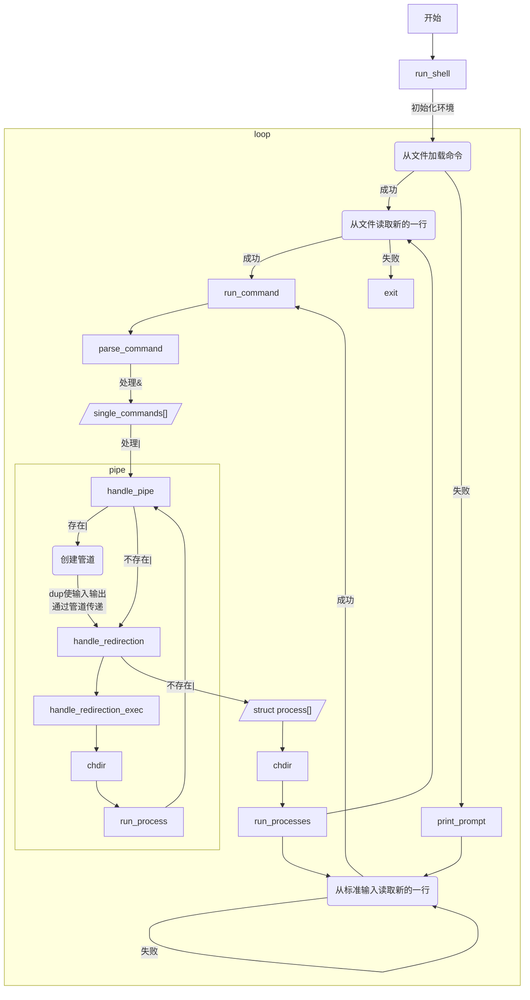

# 操作系统专题实践 - 实验2（shell）

**09019216 黄启越 2021-08** 

[TOC]

## 实验目的

通过实验了解Shell实现机制。

## 实验内容

实现具有管道、重定向功能的shell，能够执行一些简单的基本命令，如进程执行、列目录等。

1. 设计一个C语言程序，完成最基本的shell角色：给出命令行提示符、能够逐次接受命令；对于命令分成三种
   * 内部命令（例如help命令、exit命令等）
   * 外部命令（常见的ls、cp等，以及其他磁盘上的可执行程序HelloWrold等）
   * 无效命令（不是上述二种命令）
2. 具有支持管道的功能，即在shell中输入诸如“dir | more”能够执行dir命令并将其输出通过管道将其输入传送给more。
3. 具有支持重定向的功能，即在shell中输入诸如“dir > direct.txt”能够执行dir命令并将结果输出到direct.txt
4. 将上述步骤直接合并完成。

## 设计思路

实验手册上已经给出了参考方案。我在实验要求的基础上还增加了从文件读入命令并逐行执行、并行执行的功能，因此设计思路有较大的不同。

在开始运行时，首先初始化环境`environment`。然后根据调用shell时所给的参数个数决定是从批处理文件逐行读入指令（批处理模式）还是等待用户输入（交互模式）。

然后是主循环部分。只有在用户交互模式下，才会在每次执行时打印提示信息（提示信息包含当前主机名、用户名、工作目录、用户是否为root等）。然后读入一行指令，首先解析`&`符号，将一条包含多条命令的长命令分割为若干条可独立执行的命令，存入字符数组`single_commands`。然后对于每个命令，解析`|`符号。如果不存在`|`，则直接调用`handle_redirection`。如果存在`|`，则按照从左到右的顺序串行执行，上一个指令的输出为下一个指令的输入。同时管道串联的第一条指令允许使用`<`输入重定向从文件读入，最后一条指令允许通过`>`输出重定向保存到文件。

在`handle_redirection`函数中，分析指令有无`>`和`<`，确定对应的重定向类型，打开重定向文件，并记录所打开文件的文件描述符`infd`或`outfd`，分析指令指向的二进制文件所在的绝对路径以及调用的所有参数，存入`process[]`数组。

待`single_commands`里的所有指令都完成分析，并存入`process[]`后，调用`execv`并行执行，并等待完成。

分析指令主要使用`strtok`进行分割，`strdup`进行字符串的复制。管道、重定向主要使用`pipe`、`dup`、`dup2`、`close`等系统调用实现功能。执行程序用到了`fork`（创建子进程）和`execv`（用另一个程序替换当前进程镜像）。并行执行时需要用`wait`或`waitpid`等函数等待所有子进程结束。

如果是批处理模式，那么在运行到`exit`或最后一条指令后推出主循环。如果是交互模式，则只有在用户输入`exit`后会退出主循环，结束整个shell。

## 流程图

## 主要数据结构及其说明

* `struct Process`：存储进程相关信息的结构体，包含`pid`、参数个数`argc`、参数内容`argv`、可执行文件的绝对路径`exec_path`、重定向类型`redirected`、输入重定向目的地的文件描述符`redi_infd`、输出重定向目的地的文件描述符`redi_outfd`。
* `struct Environment`：存储shell运行环境相关信息，包含要查找可执行文件的所有路径`paths`、当前工作目录`cwd`，以及指示用户是否设定过`path`的布尔值`path_set_by_user`。
* `enum REDIRECTION_TYPE`：重定向类型的枚举，共包含`NO_REDI=0b0000, REDI_IN=0b0001, REDI_OUT=0b0010, REDI_OUT_IN=0b0011, REDI_IN_OUT=0b0111`。另外掩码`REDI_IN_MASK=1`用于判断有无设定输入重定向，`REDI_OUT_MASK=2`用于判断有无设定输出重定向，`REDI_IN_OUT_ORDER_MASK=4`用于指示在同时有输入重定向和输出重定向时，输入指令时所给的顺序是否为`command < in > out `。

## 程序运行时的初值和运行结果
## 实验体会

尽管在上学期的操作系统课程中，我们编写过一个简单的shell，但当时并没有要求实现管道、重定向功能，实现难度较低。本次实验新增的要求让实验难度增加了不少。

比较大的难点在于理解管道实现的机制。使用管道一般是这样的：首先声明一个数组`int fd[2]`，然后调用`pipe(fd)`创建一个管道。然后使用`dup`（还需配合`close`）或`dup2`来重定向`stdin`或`stdout`到读端`fd[0]`或写端`fd[1]`。一般还需再关闭`fd[0]`和`fd[1]`确保管道互斥。而为了将`stdin`和`stdout`恢复，一般有两种方法：1. 将管道操作在fork的子进程中进行，当子进程结束后自然恢复原样 或 2. 操作前先用`dup`保存`stdin`和`stdout`，操作完毕后恢复。本次实验我采用了两种方法混合的模式。

此外，还需要注意内存问题。编写过程中出现不少与内存有关的bug，往往是由于使用`malloc`分配内存后没有初始化。需要牢记`malloc`与C++中的`new`不同，仅仅是分配一块内存空间，并不会完成初始化的操作。可以使用`valgrind`工具帮助诊断内存问题。

总而言之，此次编写shell的实验使我感受到测试的重要性，了解到模块式开发的思维，见证了功能逐步完善的过程，加深了对shell的理解。
