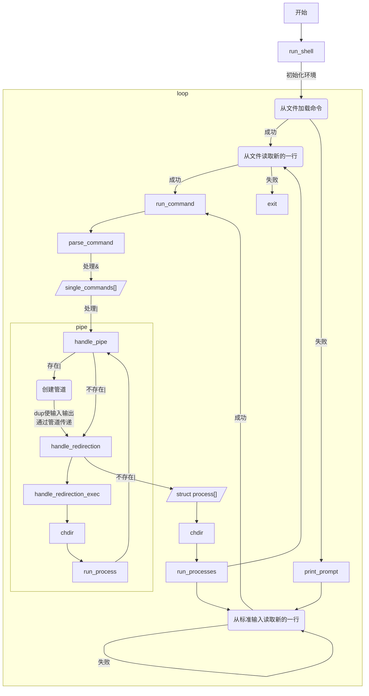

# 操作系统专题实践 - 实验2

**09019216 黄启越 2021-08** 

[TOC]

## 实现一个Shell

## 流程图

```mermaid
graph TD;
	开始-->run_shell
	run_shell-->|初始化环境|Load_Batch(从文件加载命令)
	subgraph loop
	Load_Batch-->|成功|Readline_file(从文件读取新的一行)
	Load_Batch-->|失败|print_prompt
	print_prompt-->Readline_stdin(从标准输入读取新的一行)
	Readline_file-->|成功|run_command
	Readline_file-->|失败|exit
	Readline_stdin-->|成功|run_command
	Readline_stdin-->|失败|Readline_stdin
	run_command-->parse_command
	parse_command-->|处理&|single_commands[/"single_commands[]"/]
	single_commands-->|"处理|"|handle_pipe
	handle_pipe-->|"存在|"|new_pipe(创建管道)
	subgraph pipe 
	new_pipe-->|"dup使输入输出<br/>通过管道传递"|handle_redirection
	handle_redirection-->handle_redirection_exec
	handle_redirection_exec-->chdir
	chdir-->run_process
	run_process-->handle_pipe
	end
	handle_redirection-->|"不存在|"|process[/"struct process[]"/]
	handle_pipe-->|"不存在|"|handle_redirection
	process-->chdir2[chdir]
	chdir2-->run_processes
	run_processes-->Readline_file
	run_processes-->Readline_stdin
	end
```

