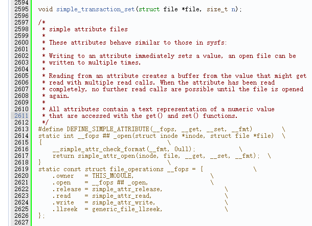
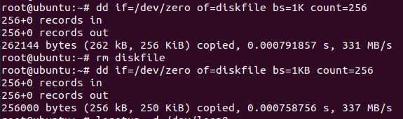
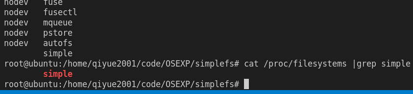
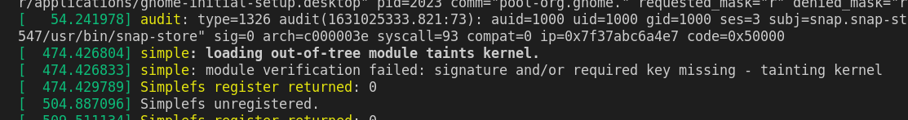
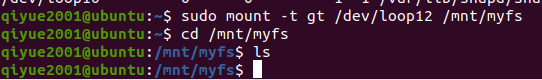
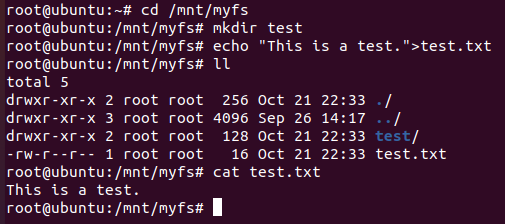
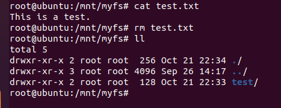
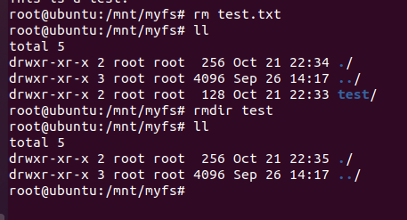
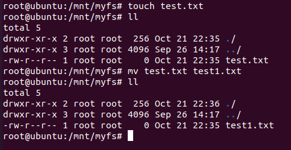

# 操作系统专题实践 - 实验3

**09019216 黄启越**

[TOC]

## 实验目的

通过实验完整了解文件系统实现机制。

## 实验内容

实现具有设备创建、分区格式化、注册文件系统、文件夹操作、文件操作功能的完整文件系统。

## 设计思路

使用loopback设备可以将一个文件挂载为块设备，同时将本次实验要实现的文件系统挂载到一个挂载点上。

文件系统的实现使用Linux模块，这样可以在需要时加载，不需要时卸载即可，不需重新编译整个Linux内核。

VFS规定了一个文件系统所需要实现的最小功能，并为内核提供了与底层文件系统交互的统一接口。

另外，即使实现了文件系统所需的内核模块，也还需要编写格式化的实用程序，一般命名为`mkfs.<filesystem>`。这样的实用程序应当能初始化superblock内的各结构，扫描整块块设备并标记坏道，将文件系统信息记录在superblock内等等。由于本次实验将一个loopback设备作为块设备，所以不必考虑坏道问题。

原本计划从零开始实现一个文件系统，但由于实现完整的文件系统的工作量很大，而本实验时间较短，所以选择在MINIX FS和GT-FS项目的基础上进行精简、修改，以理解文件系统的基本原理为主。

## 文件系统参数

本次实现的磁盘文件系统命名为`simplefs`。具体参数如下：

块大小：1KB

文件/目录名：最长60字符

魔数：`0x4e414956`（`NAIV`）

根节点inode号：1

首个可用inode号：2

## 实现原理

参考MINIX FS的设计，除了一个头文件定义文件系统的参数外，将代码分成多个C源代码，包括`dir.c`（目录）、`file.c`（文件）、`inode.c`（inode）、`super.c`（超级块）、`namei.c`（获取一个路径中所有信息）。

需要先定义若干个文件系统专有的数据结构，如inode_info（内存中的inode信息）、sb_info（内存中的超级块信息）。VFS定义了`inode`、`super_block`、`dentry`、`file`等结构，这些结构经常需要和我们自己定义的文件系统的结构进行转换。VFS的结构存在的意义在于提供一个最小的通用文件系统模型，以便于上层调用。但在具体实现文件系统的时候，还是需要关注具体细节，因此需要对我们定义的文件系统的专有结构进行操作。

与VFS定义的结构相应的，是一系列基本操作。我们编写的文件系统的总体目标就是实现这些VFS定义的基本操作。例如，VFS的`file`结构包含了`struct file_operations *`，包含了多个函数指针。按照图中代码（Linux kernel v3.7.1 `fs.h`）的示例，`llseek`可以使用通用的函数`generic_file_llseek`实现，而`read`、`release`、`write`则需要自己实现（**不同内核版本会有所不同，需要实现的函数也会不同**）。



以下是VFS各结构的简要介绍：

`superblock`包含了文件系统的元数据，保存了文件系统的各种信息（如文件名长度限制、块大小、块数等）以及可以对其执行的操作。通常采用魔数区分文件系统或同一个文件系统的不同版本。

`inode`保存了文件系统处理文件所需要的全部信息以及相应操作。磁盘上每个文件、目录均有唯一的inode。VFS的`inode`并不直接存储每个文件在磁盘上的块号。文件系统的具体实现负责将VFS中的块号转换为磁盘上的block地址。

`dentry`用于关联inode和目录。inode中是没有文件路径的，所以需要dentry来将文件路径和文件关联起来。内核在进行路径查找的时候会为每一级都建立一个dentry，比如/home/tom/code/test.cpp，就需要建立5个dentry（第一个是根目录/，第二个是home，以此类推）。dentry通过缓存机制保存在内存中以便于下次快速读取。

`file`是进程操作文件流的抽象，与实际的硬盘存储无关。经过Linux API的抽象，进程在打开文件时获得一个整数fd（file descriptor），`file`即存储进程和打开的文件之间交互的信息，这个信息只会存在于内核空间中。

## 测试

### 创建块设备

如下指令创建一个全零填充，`diskfile`文件，并创建256个1KB的块。

```shell
dd if=/dev/zero of=diskfile bs=1KB count=256
losetup /dev/loop0 diskfile
```



之后可以用如下指令解除loop0和`diskfile`的关联：

```shell
losetup -d /dev/loop0
```

### 格式化

我们熟悉的`mkfs`实用工具实际上会调用指定文件系统对应的格式化实用程序。如`mkfs -t ext2 <block device>`实际上会调用`mkfs.ext2`。所以也要实现对应的实用程序。因为`simplefs`不但simple而且naïve，所以`mkfs.simple`不考虑坏块。

格式化会输出一些信息，如所含的块数：

```
96 inodes
250 blocks
Firstdatablock=8(8)
Blocksize=1024
```


### 注册simple文件系统

先`apt-get install build-essential linux-headers-$(uname -r)`，安装内核对应的头文件。

编写Makefile：

```makefile
obj-m += simple.o

all:
	make -C /lib/modules/$(shell uname -r)/build M=$(PWD) modules

clean:
	make -C /lib/modules/$(shell uname -r)/build M=$(PWD) clean
```


`make`将编写的模块编译为扩展名为ko的内核模块。

加载：

```shell
insmod simple.ko
cat /proc/filesystems
```

即可查看是否成功注册。



```shell
rmmod simple
```

即可在不需要的时候卸载模块。

使用`dmesg`可见我们为了调试而打印的内核消息。



将`diskfile`和loop关联，并加载内核模块后，需要挂载到某个挂载点。

```shell
mkdir /mnt/myfs
sudo mount -t simple /dev/loop0 /mnt/myfs/
```

### 测试基本功能

首先使用`cd /mnt/myfs`进入目录，列出当前文件，可见是空的。



使用`mkdir test`命令创建一个子目录，再使用`echo "This is a test">test.txt`创建一个文件。注意，由于之前挂载到回环设备的实际是`/root/diskfile`，只有root才能进行文件操作。

`ll`结果表明成功创建了该文件，再使用`cat`输出内容，正确。



使用`rm test.txt`可以进行文件的删除操作。



再使用`rmdir test`删除子目录。



使用`mv`测试文件重命名。



## 实验总结

总体而言，本实验由于时间短、工程量浩大，所以以阅读现有的成熟代码为主。通过阅读MINIX FS的源代码，我感受到了工程代码的严谨性、通用性、实用性与高效性。例如，格式化程序中，为了应对各种意外情况，如磁盘坏道、内存不足、输入参数矛盾、可用硬盘块太少以至于无法存放完整的inode和块位图……，常常能见到一个函数的尾部有若干标签，对应不同的收尾工作流，而在之前产生错误的位置使用`goto`跳转到这些标签位置。尽管`goto`被不少人批判，但在如此复杂的控制逻辑下实属不得已而为之，且内核代码有足够专业且尽职的维护者确保代码的正确性，并无需担心`goto`语句被滥用。

在调试过程中，我也遇到了不少障碍。内核代码的调试不像应用程序那样可以利用IDE强大的调试功能。我使用的调试方法主要是`printk`输出中间变量，再在`dmesg`中查看。有时因不正确的跳出循环条件，导致错误消息不断地被输出，很快便用尽了磁盘空间，导致既无法进行任何其他操作，重启也无济于事。所幸虚拟机提高快照功能，可以便捷地恢复到前一状态。

还有一大难点在于Linux内核代码变化太快。市面上很少有针对5.x版本内核的文件系统相关部分的介绍。VFS接口在2.x到5.x这十余年间发生了不少变化，其中很多需要参考Linux内核项目的消息列表或更新记录才能了解。这一过程十分考验信息搜集能力和英语阅读能力。

尽管文件系统在Linux内核所占用的篇幅不多（与内存管理等部分相比），但依然复杂。在阅读源码的过程中，我感到最大的障碍在于文件系统以外的部分。例如内核中非常常见的`container_of`宏，可以通过结构体中的某个成员变量的实例获得同属于一个结构体的另一成员变量，它被定义为

```c
#define container_of(ptr, type, member) ({                      \
        const typeof( ((type *)0)->member ) *__mptr = (ptr);    \
        (type *)( (char *)__mptr - offsetof(type,member) );})
```

初看是十分复杂的。这样的宏定义很多。此外各个系统调用的作用、slab内存分配器的原理……也都需要了解。

尽管这次实验时间十分有限，只能大致了解文件系统实现的原理和基本方法，在现有项目的基础上所做的修改比较盲目，存在非常多的bug。但希望未来的某天能再次打开这些代码，努力使它更为完善。

## 参考资料

* VFS各结构的介绍： https://www.huliujia.com/blog/bff01fecc6e590d3ff7101c34f4b3c8889272751/
* VFS的inode、dentry： https://bean-li.github.io/vfs-inode-dentry/
* *Understanding the Linux Kernel 4th edition*
